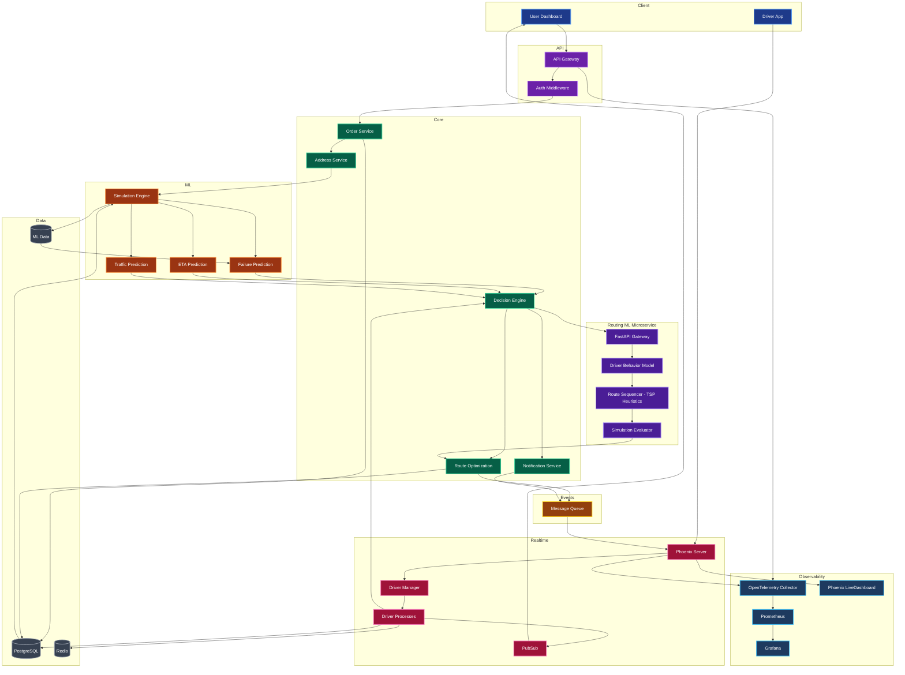

# SynapseRoute AI — Product Requirements Document

**Version:** 1.0  
**Status:** Planning 
**Last Updated:** 2026-03-25  
**Author:** Meet Patel

---

## 1. Product Overview

### What It Is

SynapseRoute AI is a predictive, adaptive last-mile delivery intelligence platform. It combines route optimization, machine learning-based failure prediction, and real-time re-routing into a unified operations dashboard — purpose-built for modern logistics at scale.

### Problem Statement

Last-mile delivery accounts for **53% of total shipping costs** and has a global average failure rate of 5–8%. Failed deliveries cascade into re-attempts, customer churn, and wasted fuel. Today's dispatch tools are static: they optimize a route once, then go blind.

### Solution

SynapseRoute AI builds a closed-loop intelligence layer on top of delivery operations. It predicts which deliveries will fail *before* a driver leaves, generates optimized multi-stop routes, and continuously adapts those routes as real-world conditions shift.

### Why It Matters

| Impact Area | Outcome |
|---|---|
| Operational cost | Fewer re-attempts, less fuel waste |
| Customer experience | Accurate ETAs, proactive failure alerts |
| Driver efficiency | Smarter load balancing, shorter routes |
| Business intelligence | Risk scoring per zone, driver performance |

---

## 2. Objectives & Goals

### Primary Objectives

- Reduce delivery failure rate through pre-departure risk scoring
- Improve ETA accuracy using ML-calibrated time estimation
- Minimize route distance and driver idle time via optimization
- Enable real-time adaptability when conditions change mid-route

### Measurable KPIs

| KPI | Baseline (Industry Avg) | Target (SynapseRoute MVP) |
|---|---|---|
| Delivery success rate | ~93% | >=97% |
| ETA accuracy (+-10 min) | ~65% | >=80% |
| Route distance reduction | — | 15–20% vs naive ordering |
| High-risk delivery detection | 0% (no prediction) | >=70% recall on synthetic test set |
| Re-route trigger latency | N/A | < 3 seconds |

---

## 3. Target Users

### Primary Users

**Delivery Manager / Dispatcher**
- Oversees all active deliveries from a central dashboard
- Places orders, monitors risk scores, and acts on re-route alerts
- Needs: clarity, speed, and actionable signals — not raw data

**Logistics Operations Team (e.g., Delhivery, Ecom Express, Amazon Logistics)**
- Uses the system to plan and optimize delivery batches
- Cares about cost-per-delivery, SLA adherence, and zone-level analytics

### Secondary Users

**Delivery Driver (Indirect)**
- Receives optimized route instructions
- Benefits from fewer failed attempts and cleaner stop sequencing

**End Customer (Indirect)**
- Receives accurate ETAs and fewer missed deliveries
- Does not interact with the platform directly in MVP

---

## 4. Problem Statement — Deep Dive

### 4.1 Static Routing Systems

Most dispatch tools compute a route once at shift start. They do not account for changing conditions — congestion, failed attempts, cancelled orders — during execution. Drivers are left to improvise.

### 4.2 No Failure Prediction

Dispatchers have no way to know that a delivery to a 4th-floor walk-up, scheduled at 9 PM in a low-coverage area, is three times more likely to fail than average. Every order is treated identically.

### 4.3 Poor Real-Time Adaptability

When a delivery fails mid-route, the remaining route is not recalculated. The driver either continues an outdated sequence or calls in manually. There is no automatic propagation of the change to downstream stops.

### 4.4 High Operational Cost

Each failed delivery attempt costs an estimated Rs. 80–150 in re-attempt logistics, customer service overhead, and lost driver time. For a fleet making 500 deliveries/day, a 7% failure rate means Rs. 28,000–52,500 wasted daily.

---

## 5. Solution Overview

SynapseRoute AI operates as a **predict-then-act** system. Before a route is committed, the platform simulates delivery conditions and scores each stop for failure probability. Routing decisions are made with that risk context embedded.

During execution, a lightweight real-time layer tracks driver progress and monitors for trigger conditions — a high-risk stop approaching, a simulated delay, or a failed delivery event. When a trigger fires, the system automatically recalculates the remaining route and pushes the update to the dashboard.

The core loop:

```
Predict risk → Optimize route → Execute → Monitor → Re-optimize → Feedback
```

This is not a static dispatcher. It is a continuously reasoning co-pilot for last-mile operations.

---

## 6. System Architecture
### Layered Architecture


### Component Interaction

```
+--------------------------------------------------+
|              Next.js Frontend                    |
|  Dashboard · Map · Order Panel · Risk Badges     |
+----------------------+---------------------------+
                       | REST / Phoenix Channels (WebSocket)
+----------------------v---------------------------+
|           Phoenix Backend (Elixir)               |
|                                                  |
|  /orders   /geocode   /simulate                  |
|  /predict  /route     /track                     |
+----+------------------+----------------+---------+
     |                  |                |
+----v--------------+   |   +------------v-----------+
| Route Engine      |   |   |   ML Inference         |
| Dijkstra / A*     |   |   |   Python Sidecar       |
| (Elixir)          |   |   |   XGBoost (.pkl)       |
+-------------------+   |   +------------------------+
                        |
         +--------------v--------------+
         | Routing ML Microservice     |
         | Python / FastAPI            |
         |                             |
         | · Driver Behavior Model     |
         | · TSP Heuristic Sequencer   |
         | · Simulation Evaluator      |
         | · OR-Tools / Custom Solver  |
         +-----------------------------+
```

> **Inter-service communication:** The Phoenix backend calls the Routing ML Microservice over HTTP/JSON. The microservice runs as an independent Python process, accepting route optimization requests and returning optimized sequences with confidence scores. The existing Elixir-based Dijkstra/A* engine handles lightweight re-routing, while the ML microservice handles batch route planning with learned driver behavior models.

---

## 7. Core Modules

### 7.1 Order Ingestion

**What it does:** Accepts delivery orders from the dashboard form, validates input, and stores orders in the system state.

| | Detail |
|---|---|
| Input | Recipient name, address string, location type, time preference |
| Output | Order object with UUID, timestamp, and `pending` status |

### 7.2 Address Intelligence

**What it does:** Geocodes raw address strings into (lat, lng) coordinates. Tags the address with a zone ID and location type for downstream ML use.

| | Detail |
|---|---|
| Input | Raw address string |
| Output | `{ lat, lng, zone_id, location_type, normalized_address }` |

### 7.3 Simulation Engine

**What it does:** Simulates driver movement along an assigned route, advancing position every 5 seconds. Triggers events (delay, failed attempt) based on risk scores.

| | Detail |
|---|---|
| Input | Driver route, risk scores per stop |
| Output | Driver position stream, delivery status events |

### 7.4 Failure Predictor

**What it does:** Scores each delivery with a failure probability using a pre-trained ML model. Classifies into Low / Medium / High risk tiers.

| | Detail |
|---|---|
| Input | Time of day, location type, zone failure rate, distance from depot, weather category |
| Output | `{ failure_probability: 0.73, risk_tier: "high" }` |

### 7.5 Route Optimization Engine

**What it does:** Computes the optimal stop sequence for each driver using Dijkstra or A* on a delivery graph. Minimizes total travel distance while respecting driver load and risk-weighted constraints.

| Stage | Detail |
|---|---|
| **Input** | Stops (geocoded coords), time windows, delivery constraints (priority, vehicle capacity), driver list, depot location |
| **Preprocessing** | Normalize coordinates, build distance/time matrices, apply zone-level risk weights to edges |
| **Route Sequencing** | Hybrid approach — ML-predicted sequence as initial seed, refined by TSP heuristic solver (nearest-neighbor + 2-opt improvement) |
| **Output** | Ordered stop sequence per driver, ETA per stop, total route distance/duration, **confidence score** (0–1) indicating route quality relative to historical driver behavior |

### 7.5.1 Advanced Routing Engine (ML + Optimization Hybrid)

**What it does:** An advanced routing layer inspired by [Amazon's Last Mile Routing Research Challenge](https://amazon-sagemaker-amt.com/). Combines machine learning (driver behavior modeling), heuristic optimization (TSP-based sequencing), and simulation-based evaluation to produce routes that reflect how experienced drivers actually navigate — not just shortest-path theory.

| Component | Detail |
|---|---|
| **Driver Behavior Model** | ML model trained on historical delivery sequences to predict likely stop ordering patterns. Captures implicit driver preferences (e.g., avoiding left turns, preferring arterial roads, clustering by neighborhood). |
| **TSP Heuristic Sequencer** | Solves the Travelling Salesman Problem variant using OR-Tools or custom heuristics (nearest-neighbor initialization + 2-opt/3-opt local search). Uses ML-predicted sequence as a warm start. |
| **Simulation Evaluator** | Evaluates candidate routes by simulating execution — estimates total time, risk exposure, and delivery success probability. Ranks route alternatives by composite score. |
| **Feedback Integration** | Completed delivery sequences feed back into the driver behavior model, enabling continuous learning and route quality improvement over time. |

> **Relationship to 7.5:** The Advanced Routing Engine extends the base Dijkstra/A* engine. For real-time re-routing (7.6), the lightweight Elixir-based engine handles fast recalculations. For batch route planning at dispatch time, the ML-hybrid engine produces higher-quality initial routes via the Python/FastAPI microservice.

### 7.6 Re-optimization Engine

**What it does:** Monitors for trigger conditions during route execution. When triggered (high-risk stop, simulated failure, cancellation), recalculates the remaining route without disrupting completed stops.

| | Detail |
|---|---|
| Input | Current driver position, remaining stops, trigger event |
| Output | Updated route from current position onward |

### 7.7 Notification System

**What it does:** Pushes in-dashboard alerts when a re-route is triggered, a high-risk delivery is approaching, or a simulated failure occurs.

| | Detail |
|---|---|
| Input | Trigger event type + affected order ID |
| Output | Toast notification in the UI with contextual message |

### 7.8 Analytics Engine

**What it does:** Aggregates delivery outcomes, risk scores, and route performance for display in the dashboard summary panel.

| | Detail |
|---|---|
| Input | Delivery status log, risk scores, route durations |
| Output | Summary stats: total deliveries, high-risk count, avg ETA accuracy |

### 7.9 Observability Layer

**What it does:** Provides end-to-end visibility into system health, request flows, and operational metrics. Combines structured logging, distributed tracing, and metrics collection across the Phoenix backend and Python ML sidecar.

| | Detail |
|---|---|
| Structured Logging | Elixir `Logger` with JSON output; correlation IDs propagated across services |
| Distributed Tracing | OpenTelemetry traces span Phoenix request handling → ML sidecar inference → route computation |
| Metrics | `:telemetry`-based metrics exported to Prometheus — request latency, ML inference time, route computation duration, delivery outcomes |
| Dashboards | Grafana boards for operational monitoring; Phoenix LiveDashboard for dev-time introspection (processes, ETS tables, socket connections) |
| Alerting | Prometheus alerting rules for: ML inference latency > 500ms, route computation > 3s, error rate > 5% |
| Health Checks | `/api/health` endpoint reporting Phoenix, ML sidecar, and database connectivity status |

---

## 8. Key Features

### AI Features

| Feature | Description |
|---|---|
| Delivery Failure Prediction | ML model scores each order 0–100% for failure likelihood before dispatch |
| Risk Tier Classification | Probability bucketed into Low / Medium / High with color-coded badge |
| ETA Estimation | Distance + time-of-day calibrated estimate per stop |
| Zone Intelligence | Historical failure rates per geographic zone feed the ML model |

### Real-Time Features

| Feature | Description |
|---|---|
| Live Driver Tracking | Simulated driver icon moves along route on the map in real time |
| Dynamic Re-routing | Route recalculates automatically on trigger events |
| Event Streaming | Phoenix Channels (WebSocket) delivers position updates every 5 seconds |
| Re-route Notification | Toast alert surfaces when a route is modified |

### Business Features

| Feature | Description |
|---|---|
| Driver Load Balancing | Deliveries assigned across drivers to equalize stop count and distance |
| Cost Proxy Metric | Estimated time-on-road shown per driver as a cost signal |
| Order Risk Summary | Dashboard panel shows count of Low / Medium / High risk orders at a glance |
| Replay Log | Sequence of events (risk flags, re-routes) logged for post-demo review |

---

## 9. Data Flow

### End-to-End Pipeline

```
[1] User places order via dashboard form
        |
        v
[2] Address geocoded → (lat, lng, zone_id) resolved
        |
        v
[3] ML Failure Predictor scores the order
    → failure_probability, risk_tier assigned
        |
        v
[4] Routing ML Engine processes batch
    → Driver behavior model predicts optimal sequencing
    → TSP heuristic refines stop order
    → Simulation evaluator scores candidate routes
        |
        v
[5] Route Optimization Engine finalizes routes
    → Optimal stop sequence + ETA + confidence score computed per driver
        |
        v
[6] Routes + risk scores rendered on live map
    → Pins colored by risk tier, polylines drawn
        |
        v
[7] Simulation Engine advances driver positions (every 5s)
    → Driver icon moves on map
        |
        v
[8] Re-optimization Engine monitors for triggers
    → High-risk stop / simulated failure → route recalculated
        |
        v
[9] Updated route pushed to frontend via Phoenix Channels
    → Notification surfaced, polyline updated
        |
        v
[10] Delivery marked complete / failed
    → Outcome logged to Feedback Layer
    → Zone failure rate updated for future predictions
    → Completed sequence fed back to driver behavior model
```

### Simplified Flow

```
Order → Geocode → Predict → Routing ML Engine → Optimize → Dispatch
                                                    |
                                              [Simulation Loop]
                                                    |
                                         Monitor → Trigger? → Re-optimize
                                                    |
                                                 Complete → Feedback → ML Model Update
```

---

## 10. API Design

### Endpoints

| Method | Endpoint | Description |
|---|---|---|
| `POST` | `/api/orders` | Create a new delivery order |
| `GET` | `/api/orders` | List all orders with status |
| `POST` | `/api/geocode` | Geocode an address string |
| `POST` | `/api/predict` | Get failure probability for an order |
| `POST` | `/api/route/optimize` | Run route optimization for pending orders |
| `GET` | `/api/simulate/tick` | Advance driver simulation by one step |
| `POST` | `/api/route/reroute` | Trigger re-optimization for a driver |
| `GET` | `/api/track` | Get current driver positions |
| `GET` | `/api/analytics/summary` | Get dashboard summary stats |

### Sample Payloads

**POST /api/orders**
```json
Request:
{
  "recipient_name": "Arjun Mehta",
  "address": "14 Anna Salai, Chennai, TN",
  "location_type": "commercial",
  "time_preference": "asap"
}

Response:
{
  "order_id": "ord_7f3a1c",
  "coords": [13.0604, 80.2496],
  "zone_id": "Z4",
  "status": "pending",
  "created_at": "2026-03-25T10:30:00Z"
}
```

**POST /api/predict**
```json
Request:
{
  "order_id": "ord_7f3a1c",
  "time_of_day": 21,
  "location_type": "commercial",
  "zone_id": "Z4",
  "weather_category": "rain"
}

Response:
{
  "order_id": "ord_7f3a1c",
  "failure_probability": 0.78,
  "risk_tier": "high",
  "contributing_factors": ["late_hour", "rain", "zone_history"]
}
```

**POST /api/route/optimize**
```json
Request:
{
  "order_ids": ["ord_7f3a1c", "ord_2b9d4e", "ord_5a1f7b"],
  "driver_ids": ["drv_alpha", "drv_beta"],
  "depot_coords": [13.0827, 80.2707]
}

Response:
{
  "routes": [
    {
      "driver_id": "drv_alpha",
      "stops": [
        { "order_id": "ord_2b9d4e", "sequence": 1, "eta": "2026-03-25T11:15:00Z", "risk_tier": "low" },
        { "order_id": "ord_7f3a1c", "sequence": 2, "eta": "2026-03-25T11:40:00Z", "risk_tier": "high" }
      ],
      "total_distance_km": 12.4,
      "total_duration_min": 48
    }
  ]
}
```

---

## 11. Data Model

### Order

```
Order {
  order_id          : UUID (PK)
  recipient_name    : string
  raw_address       : string
  lat               : float
  lng               : float
  zone_id           : string
  location_type     : enum [residential, commercial]
  time_preference   : enum [asap, scheduled]
  scheduled_time    : datetime | null
  status            : enum [pending, assigned, in_transit, delivered, failed]
  failure_prob      : float
  risk_tier         : enum [low, medium, high]
  assigned_driver   : Driver.driver_id | null
  eta               : datetime | null
  created_at        : datetime
  completed_at      : datetime | null
}
```

### Driver

```
Driver {
  driver_id         : UUID (PK)
  name              : string
  current_lat       : float
  current_lng       : float
  status            : enum [idle, on_route, break]
  active_route_id   : Route.route_id | null
  total_deliveries  : int
  success_rate      : float
}
```

### Route

```
Route {
  route_id          : UUID (PK)
  driver_id         : Driver.driver_id
  stops             : OrderedList[RouteStop]
  depot_coords      : [float, float]
  total_distance_km : float
  total_duration_min: int
  status            : enum [planned, active, completed]
  created_at        : datetime
  last_updated_at   : datetime
}

RouteStop {
  order_id          : Order.order_id
  sequence          : int
  eta               : datetime
  arrived_at        : datetime | null
  status            : enum [pending, completed, failed]
}
```

### DeliveryEvent

```
DeliveryEvent {
  event_id          : UUID (PK)
  order_id          : Order.order_id
  event_type        : enum [risk_flagged, rerouted, delivered, failed, delayed]
  timestamp         : datetime
  payload           : JSON
}
```

---

## 12. Machine Learning Design

### Models

| Model | Purpose | Algorithm |
|---|---|---|
| Failure Predictor | Predict probability a delivery will fail | XGBoost Classifier |
| ETA Estimator | Predict minutes to complete a stop | Linear Regression (v1) |

### Failure Predictor — Feature Set

| Feature | Type | Source |
|---|---|---|
| `hour_of_day` | int (0–23) | Order time |
| `day_of_week` | int (0–6) | Order date |
| `location_type` | categorical | Order form |
| `zone_failure_rate` | float | Historical / synthetic |
| `distance_from_depot_km` | float | Geocoded coords |
| `weather_category` | categorical | Mocked (clear / rain / extreme) |
| `is_evening` | binary | Derived: hour >= 18 |
| `is_weekend` | binary | Derived: day_of_week in [5, 6] |

### Training Approach

- **Dataset:** 5,000 synthetic rows generated with realistic correlations (evening + residential + rain → higher P(failure))
- **Split:** 80% train / 20% test
- **Evaluation metric:** AUC-ROC (target >= 0.75), F1-score on High Risk class
- **Serialization:** `model.pkl` served via a Python ML sidecar service, called from Phoenix over HTTP
- **Inference latency target:** < 200ms per delivery

### Risk Tier Mapping

```
failure_probability < 0.30              →  LOW    (green)
0.30 <= failure_probability < 0.65      →  MEDIUM (yellow)
failure_probability >= 0.65             →  HIGH   (red)
```

---

## 13. Tech Stack

| Layer | Technology | Rationale |
|---|---|---|
| Frontend | Next.js 14 + Tailwind CSS | Fast build, SSR-ready, component ecosystem |
| Map | Leaflet.js (MVP) / Mapbox GL JS (v2) | Leaflet is zero-config; Mapbox for polish |
| Backend | Phoenix (Elixir) | Fault-tolerant, native WebSocket support via Channels, lightweight processes for driver simulation |
| Route Engine | Custom Dijkstra / A* (Elixir) | Full control, leverages BEAM concurrency |
| Routing ML Microservice | Python (FastAPI) | Dedicated service for ML-based route optimization; communicates with Phoenix backend over HTTP/JSON |
| Route Optimization Solver | Google OR-Tools / custom heuristics | TSP/VRP solver for stop sequencing; OR-Tools provides production-grade constraint programming with Python bindings |
| ML — Route Sequencing | scikit-learn / XGBoost | Driver behavior modeling and sequence prediction; trained on historical delivery patterns to generate warm-start solutions |
| ML — Failure Prediction | Python sidecar (scikit-learn / XGBoost + joblib) | Lightweight, serializable, fast inference; called from Phoenix over HTTP |
| Real-Time | Phoenix Channels + Phoenix PubSub | Native WebSocket transport; ETS-backed PubSub for driver position events |
| Geocoding | OpenStreetMap Nominatim | Free, no API key, sufficient for demo |
| State (MVP) | ETS / Agent (in-memory Elixir) | No DB required for hackathon scope; leverages BEAM's built-in state primitives |
| State (v2) | PostgreSQL + Ecto | Production data persistence with Elixir-native ORM |
| Observability | OpenTelemetry + Prometheus + Grafana | Distributed tracing, metrics, and dashboards; Phoenix LiveDashboard for dev |
| Deployment | Vercel (frontend) + Fly.io / Railway (backend) | Fast CI/CD; Fly.io optimized for BEAM apps |

---

## 14. Metrics for Success

### Delivery Performance

| Metric | Description | Target |
|---|---|---|
| Delivery Success Rate | % of orders completed on first attempt | >= 97% (demo set) |
| ETA Accuracy | % of stops delivered within +-10 min of ETA | >= 80% |
| High-Risk Recall | % of actual failures flagged as High Risk by ML | >= 70% |

### Route Efficiency

| Metric | Description | Target |
|---|---|---|
| Route Distance Reduction | vs. naive (insertion order) routing | 15–20% |
| Re-route Latency | Time from trigger to updated route on UI | < 3 seconds |
| Driver Load Balance | Standard deviation of stops per driver | < 1.5 stops |

### System Performance

| Metric | Description | Target |
|---|---|---|
| Inference Latency | ML prediction per order (Phoenix → sidecar round-trip) | < 200ms |
| Route Computation Time | Optimization for 5 orders, 2 drivers | < 1 second |
| Map Load Time | Initial dashboard render | < 3 seconds |

### Observability

| Metric | Description | Target |
|---|---|---|
| Trace Coverage | % of requests with end-to-end distributed trace | 100% |
| Log Correlation | % of log entries with request correlation ID | 100% |
| Dashboard Uptime | Grafana/LiveDashboard availability | >= 99% |
| Alert Latency | Time from anomaly to alert firing | < 30 seconds |

---

## 15. MVP Scope

### What Is Real (Built)

- Order placement form with live geocoding
- Route optimization via Dijkstra/A*
- ML failure prediction (XGBoost trained on synthetic data)
- Map dashboard with pins, polylines, and risk badges
- Simulated driver movement on map (position updated every 5s via Phoenix Channels)
- Re-route trigger on High Risk flag
- Phoenix LiveDashboard for dev-time observability
- Structured logging with correlation IDs

### What Is Simulated / Mocked

- Driver GPS positions (rule-based movement along route polyline)
- Weather data (hardcoded category per order, not a live API)
- Zone historical failure rates (synthetic lookup table)
- Delivery outcome (auto-resolved after simulated transit time)

### What Is Deferred to v2

- Real GPS integration
- Live traffic data
- Multi-tenant auth and role management
- Production database (PostgreSQL + Ecto)
- Customer-facing delivery tracking link
- Mobile driver app
- Full Prometheus + Grafana observability stack
- OpenTelemetry distributed tracing across services

---

## 16. Future Scope

| Capability | Description |
|---|---|
| Reinforcement Learning | Train an RL agent to re-route dynamically based on live reward signals (successful deliveries, time saved) |
| Autonomous Delivery Planning | Fully automated shift planning — zero dispatcher input required |
| Advanced Simulation | Monte Carlo simulation of delivery scenarios before committing a route |
| Multi-City Scaling | Federated zone models per city with shared global failure priors |
| Driver Behavior Modeling | Personalized ETA and failure models per driver based on historical patterns |
| Natural Language Dispatch | "Schedule 12 deliveries for tomorrow morning" parsed and dispatched by LLM layer |
| Customer Communication Layer | Automated ETA updates and re-scheduling via SMS/WhatsApp triggered by risk events |

---

## 16.1 Routing Engine — Limitations

The Advanced Routing Engine (7.5.1) is inspired by Amazon's Last Mile Routing Research Challenge. The base research model has inherent constraints that inform how it is integrated into SynapseRoute:

| Limitation | Detail |
|---|---|
| **Offline by design** | The research model operates on pre-computed route data. It does not natively support real-time inputs (live traffic, sudden cancellations, driver location updates). |
| **Not real-time** | Route computation involves ML inference + heuristic optimization + simulation evaluation — a pipeline that may take seconds to complete. Not suitable for sub-second re-routing during active delivery. |
| **Research-focused** | The original challenge optimized for route quality on historical data. It was not designed for production deployment with SLA requirements, high availability, or horizontal scaling. |
| **Data dependency** | Model quality depends on historical driver sequence data. In cold-start scenarios (new city, new driver pool), the model falls back to pure heuristic optimization without learned behavior priors. |

> **Implication:** SynapseRoute uses this engine for **batch route planning at dispatch time** (where latency tolerance is higher), not for real-time re-routing. The lightweight Elixir-based Dijkstra/A* engine handles all real-time re-optimization (7.6).

---

## 16.2 Routing Engine — Enhancements over Research Baseline

SynapseRoute extends the base research model with production-grade capabilities:

| Enhancement | Detail |
|---|---|
| **Real-time re-routing** | The Elixir-based re-optimization engine (7.6) handles dynamic route changes during execution. When a trigger fires, the remaining route is recalculated in < 3 seconds using the lightweight A* engine — no dependency on the ML microservice. |
| **Failure prediction integration** | Route optimization is risk-aware. The failure predictor (7.4) scores each stop before routing, and the optimizer uses risk tiers to adjust stop sequencing — high-risk stops are scheduled earlier in the route when driver capacity is highest, or flagged for proactive intervention. |
| **API-based deployment** | The research model is wrapped in a FastAPI microservice with versioned endpoints (`POST /api/route/optimize`). This enables independent scaling, A/B testing of routing strategies, and clean separation from the core Phoenix backend. |
| **Feedback loop for continuous learning** | Completed delivery sequences (actual stop order, time per stop, success/failure outcomes) are fed back into the driver behavior model. This creates a continuous learning cycle: routes improve as the system accumulates operational data. The feedback pipeline runs asynchronously — it does not block active routing. |
| **Confidence scoring** | Each optimized route includes a confidence score (0–1) indicating how closely the ML-predicted sequence aligns with the heuristic-optimized result. Low-confidence routes are flagged for dispatcher review before dispatch. |

---

## 17. Risks & Challenges

| Risk | Likelihood | Impact | Mitigation |
|---|---|---|---|
| Geocoding API rate limits | Medium | High | Use Nominatim (free); cache coordinate results |
| ML model poor accuracy on synthetic data | Low | Medium | Hand-tune synthetic correlations; use XGBoost over logistic regression |
| Redis unavailable in deploy environment | Medium | Medium | Fall back to in-memory mock with 5-second polling |
| Route engine too slow at scale | Low | High | Pre-compute on order placement; cache result; limit to 10 stops/driver for demo |
| Map library integration delay | Low | Medium | Default to Leaflet.js; switch to Mapbox only if time allows |
| Real-time updates causing UI jank | Medium | Low | Throttle map re-renders; only update changed pins, not full redraw |
| Python ML sidecar latency | Medium | Medium | Keep sidecar co-located with Phoenix; connection pooling via Finch; cache predictions for identical feature vectors |
| Demo environment has no internet | Low | High | Bundle fixture geocoordinates for fallback (Chennai sample dataset) |

---

*SynapseRoute AI — PRD v1.0*
